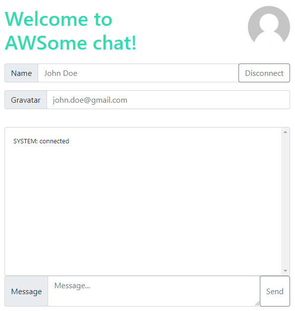
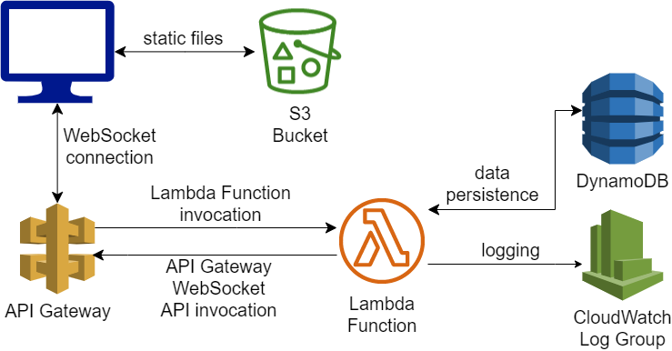

[](https://www.terraform.io/)

# AWSome chat

This repository contains an example chat application using AWS services with the infrastructure implemented in Terraform.

<p align="center">
  <kbd>
    
  </kbd>
</p>

## Install and compile

Install dependencies to the backend, frontend and terraform. Compile and bundle frontend and backend application components.

```bash
$ npm install
$ npm run build
```

## Terraform deployment

Configure your AWS CLI profile, then execute the following commands.

```bash
$ cd terraform
$ terraform plan
$ terraform apply
```

<p align="center">
  <kbd>
    
  </kbd>
</p>

## Clean up terraform deployment

```bash
$ terraform destroy
```
